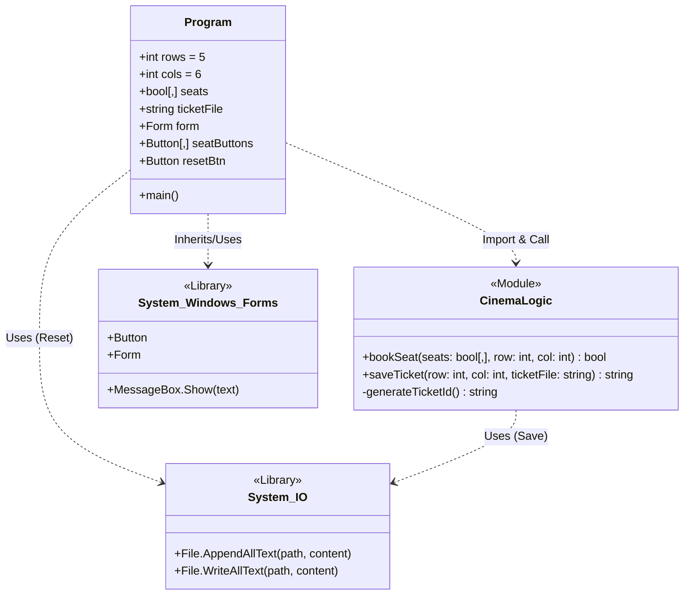
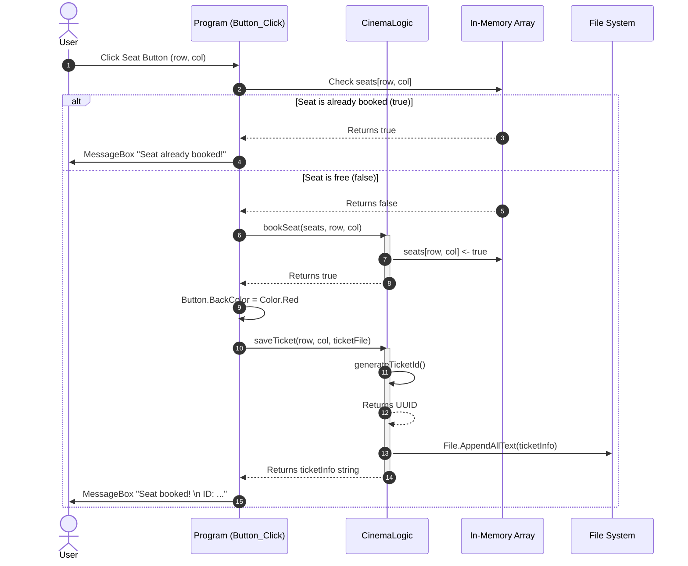
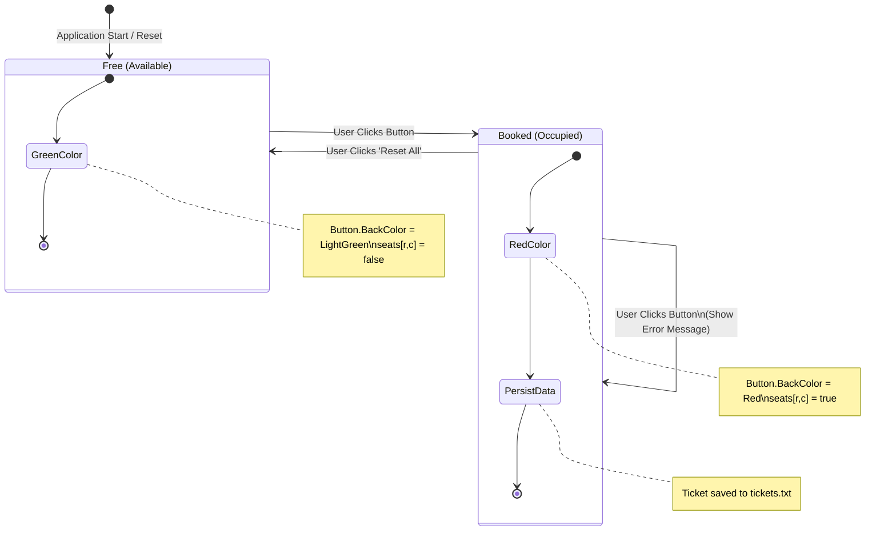

# Cinema Reservation System - Full Architecture Documentation

This document provides a complete technical breakdown of the system using standard UML diagram types rendered with Mermaid.

## 1. Static Structure (Class/Module Diagram)
This diagram represents the code structure, mapping F# modules to classes and showing exact dependencies and members.

## 2. Dynamic Behavior (Sequence Diagram)
This diagram details the exact runtime flow when a user clicks a seat button.

## 3. System States (State Machine Diagram)
This diagram represents the lifecycle of a single seat within the system.

