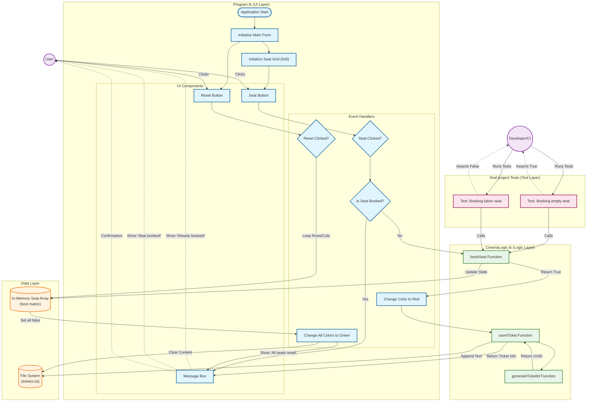

# Cinema Reservation System - Block Diagram

```mermaid
graph TD
    %% Actors
    User((User))
    Tester((Developer/CI))

    %% Subgraph for the Application Entry Point and UI
    subgraph "Program.fs (UI Layer)"
        AppStart(["Application Start"])
        InitForm["Initialize Main Form"]
        InitGrid["Initialize Seat Grid (5x6)"]
        
        subgraph "UI Components"
            SeatBtn["Seat Button"]
            ResetBtn["Reset Button"]
            MsgBox["Message Box"]
        end
        
        subgraph "Event Handlers"
            OnSeatClick{"Seat Clicked?"}
            OnResetClick{"Reset Clicked?"}
            CheckBooked{"Is Seat Booked?"}
            UpdateUI_Booked["Change Color to Red"]
            UpdateUI_Reset["Change All Colors to Green"]
        end
    end

    %% Subgraph for Business Logic
    subgraph "CinemaLogic.fs (Logic Layer)"
        BookSeatFunc["bookSeat Function"]
        SaveTicketFunc["saveTicket Function"]
        GenIdFunc["generateTicketId Function"]
    end

    %% Subgraph for Data Storage
    subgraph "Data Layer"
        MemoryArray[("In-Memory Seat Array<br>(bool matrix)")]
        FileSystem[("File System<br>(tickets.txt)")]
    end

    %% Subgraph for Tests
    subgraph "final project.Tests (Test Layer)"
        Test1["Test: Booking empty seat"]
        Test2["Test: Booking taken seat"]
    end

    %% Flow Connections
    AppStart --> InitForm
    InitForm --> InitGrid
    InitGrid --> SeatBtn
    InitForm --> ResetBtn

    %% User Interactions
    User -->|Clicks| SeatBtn
    User -->|Clicks| ResetBtn

    %% Seat Click Flow
    SeatBtn --> OnSeatClick
    OnSeatClick --> CheckBooked
    CheckBooked -- Yes --> MsgBox
    MsgBox -.->|Show 'Already booked!'| User
    
    CheckBooked -- No --> BookSeatFunc
    BookSeatFunc -->|Update State| MemoryArray
    BookSeatFunc -->|Return True| UpdateUI_Booked
    
    UpdateUI_Booked --> SaveTicketFunc
    SaveTicketFunc --> GenIdFunc
    GenIdFunc -->|Return UUID| SaveTicketFunc
    SaveTicketFunc -->|Append Text| FileSystem
    SaveTicketFunc -->|Return Ticket Info| MsgBox
    MsgBox -.->|Show 'Seat booked!'| User

    %% Reset Click Flow
    ResetBtn --> OnResetClick
    OnResetClick -->|Loop Rows/Cols| MemoryArray
    MemoryArray -->|Set all false| UpdateUI_Reset
    UpdateUI_Reset -->|Clear Content| FileSystem
    UpdateUI_Reset -->|Show 'All seats reset!'| MsgBox
    MsgBox -.->|Confirmation| User

    %% Test Flow
    Tester -->|Runs Tests| Test1
    Tester -->|Runs Tests| Test2
    Test1 -->|Calls| BookSeatFunc
    Test2 -->|Calls| BookSeatFunc
    Test1 -.->|Asserts True| Tester
    Test2 -.->|Asserts False| Tester

    %% Styling
    classDef ui fill:#e1f5fe,stroke:#01579b,stroke-width:2px;
    classDef logic fill:#e8f5e9,stroke:#2e7d32,stroke-width:2px;
    classDef data fill:#fff3e0,stroke:#ef6c00,stroke-width:2px;
    classDef test fill:#fce4ec,stroke:#880e4f,stroke-width:2px;
    classDef actor fill:#f3e5f5,stroke:#7b1fa2,stroke-width:2px;

    class AppStart,InitForm,InitGrid,SeatBtn,ResetBtn,MsgBox,OnSeatClick,OnResetClick,CheckBooked,UpdateUI_Booked,UpdateUI_Reset ui;
    class BookSeatFunc,SaveTicketFunc,GenIdFunc logic;
    class MemoryArray,FileSystem data;
    class Test1,Test2 test;
    class User,Tester actor;
```
