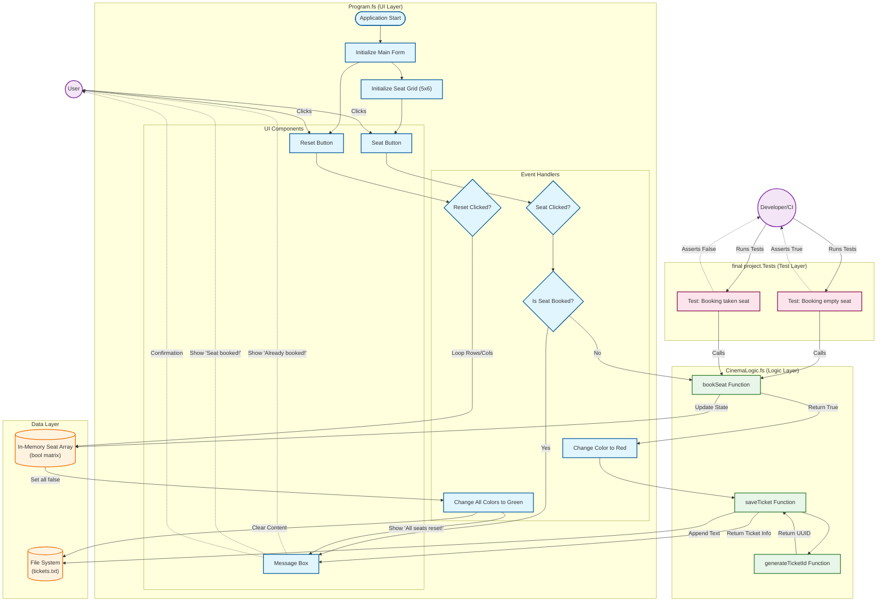
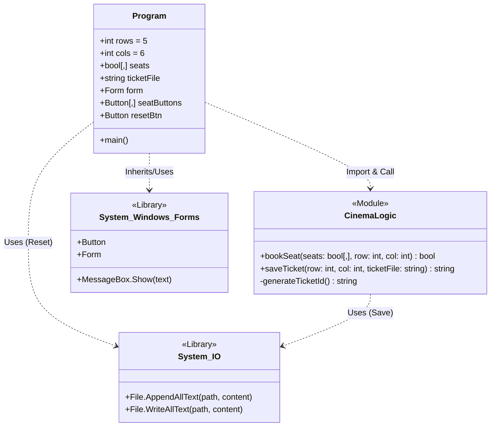
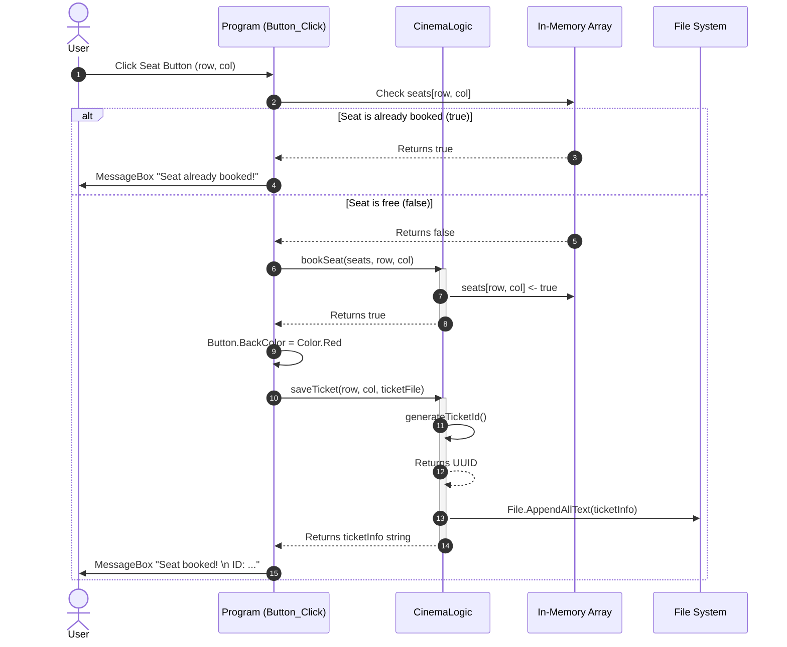

# Cinema Reservation System


A desktop application for managing cinema seat reservations. Built with F# and WinForms, this project demonstrates functional programming principles applied to a UI application, featuring persistent storage and a testable business logic layer.

---

## Features

*   **Interactive Seat Grid**: Visual 5x6 grid representing the cinema hall.
*   **Real-time Feedback**: Immediate visual cues (Green for free, Red for booked).
*   **Conflict Prevention**: Logic to prevent double-booking of seats.
*   **Data Persistence**: Automatic saving of ticket data to local file storage.
*   **Reset Functionality**: Administrative reset to clear all bookings.
*   **Ticket Generation**: Unique UUID generation for every successful booking.

---

## Architecture and Design

This project follows a layered architecture, separating the Presentation, Business Logic, and Data Persistence layers.

### System Block Diagram



### Technical Architecture

#### Class Structure



#### Booking Sequence



---

## Getting Started

### Prerequisites
*   .NET SDK (Version 6.0 or later)

### Installation
1.  Clone the repository.
2.  Navigate to the project directory: `Cinema_Reservation_System/final project`

### Running the Application
Run the project using the dotnet CLI:
```bash
dotnet run
```

---

## Project Structure

*   **final project/**: Main Application
    *   `Program.fs`: UI Entry Point and Event Handling
    *   `CinemaLogic.fs`: Pure Business Logic
*   **final project.Tests/**: Unit Tests
    *   `Tests.fs`: Xunit Test Cases

---

## Testing Strategy

The project employs a dual-layer testing strategy to ensure reliability across both business logic and user interaction.

### 1. Automated Unit Testing (Logic Layer)
*   **Framework**: Xunit
*   **Scope**: `CinemaLogic.fs`
*   **Coverage**:
    *   **Valid Booking**: Ensures a free seat returns `true` and updates state.
    *   **Double Booking**: Ensures attempting to book an occupied seat returns `false`.
    *   **State Integrity**: Verifies the in-memory array reflects changes accurately.

To execute the automated suite:
```bash
dotnet test
```

### 2. Manual User Acceptance Testing (UI Layer)
*   **Scope**: `Program.fs` (WinForms UI)
*   **Test Cases**:
    *   **Visual Verification**: Confirm seats change from Green to Red upon clicking.
    *   **Persistence Check**: Verify `tickets.txt` is created/updated after a booking.
    *   **Reset Validation**: Confirm "Reset All" clears the grid visually and empties the file.
    *   **Error Handling**: Verify the "Seat already booked!" message appears when clicking a red seat.

---

## Team Roles and Architecture Mapping

The project's modular architecture is designed to support the specific roles defined in the project requirements.

| Role | Responsibility | Project Component |
| :--- | :--- | :--- |
| **1. Seat Layout Architect** | Defines 2D array structure | `Program.fs` (rows/cols definition) |
| **2. Display Developer** | Visualizes grid in UI | `Program.fs` (Button grid generation) |
| **3. Booking Logic Developer** | Implements core rules | `CinemaLogic.bookSeat` |
| **4. Ticket System Developer** | Unique IDs + format | `CinemaLogic.generateTicketId` |
| **5. File Storage Developer** | Saves data to disk | `CinemaLogic.saveTicket` |
| **6. UI Developer** | Main Form & Controls | `Program.fs` (Form, Controls) |
| **7. Tester** | Verifies functionality | `final project.Tests` |
| **8. Documentation Lead** | Maintains docs & graphs | `README.md`, `ArchitectureGraph.md` |

---

## Code Reference

### Module: CinemaLogic
Contains the core business logic for the Cinema Reservation System. Handles seat booking validation and ticket generation.

*   **`bookSeat(seats: bool[,], row: int, col: int) -> bool`**
    *   Attempts to book a specific seat.
    *   Returns `true` if successful (seat was free), `false` if already booked.

*   **`saveTicket(row: int, col: int, ticketFile: string) -> string`**
    *   Persists ticket information to a file and returns the ticket details.
    *   Generates a unique Ticket ID internally.

*   **`generateTicketId() -> string`**
    *   Generates a unique identifier (UUID) for a ticket.

### Module: Program
Entry point for the application. Manages UI initialization, event handling, and application lifecycle.

*   **`seats: bool[,]`**
    *   In-memory representation of the seat grid (5x6).
    *   `true` = Booked, `false` = Free.

*   **`seatButtons: Button[,]`**
    *   Visual representation of the grid.
    *   Handles click events to trigger `CinemaLogic.bookSeat`.

*   **`resetBtn: Button`**
    *   Resets the entire cinema state (memory and file) to initial empty state.

---

## Technologies

*   F#
*   .NET
*   Windows Forms
*   Xunit
*   Mermaid.js
